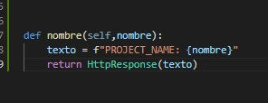
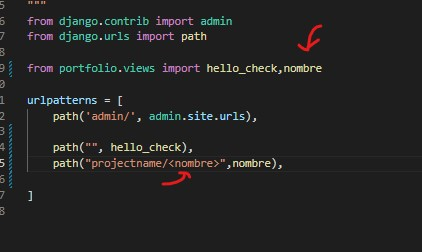
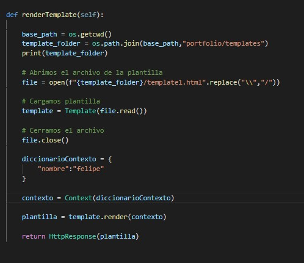
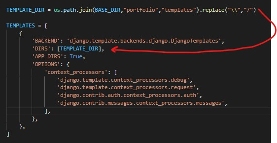
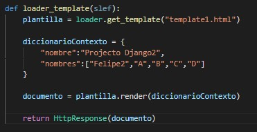
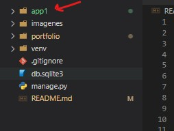
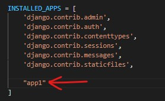
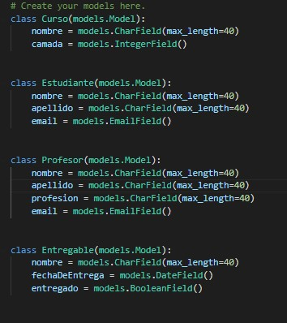
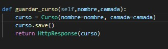
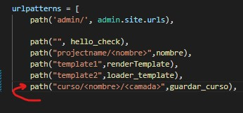

# DJANGO    
## Ambiente virutal y Settings
```powershell
# creamos entorno virtual
python -m virtualenv venv

# activamos el entorno virtual
.\venv\Scripts\activate

# instalamos django en el entorno
pip install django

# creamos el project
django-admin startproject [projecto] .
```

## Primeros pasos
```powershell
# realizamos las migraciones predeterminadas sqlite
python manage.py migrate

# Corremos el servidor
python manage.py runserver
```

## Views
Para crear Views en Django:
- debemos crear un archivo llamado views dentro de nuestro [projecto] y ahí empezar hacer las funciones de las vistas.
- Agregarlo en el archivo de urls, tener en cuenta que django agrega automaticamente el primer "/".

### Vista estatica:
- 
- 

### Vista con parametros Url:
- dentro del mismo archivo ```views.py```
- 
- 

### Plantillas:
- Necesitaremos:
    - Template.
    - Contexto.
    - Render.
- Dentro del proyeto creamos una carpeta llamada templates.
- 

### Cargador de plantillas.
- En las vistas, importamos el cargador ```from django.template import loader```
- En ```settings.py``` buscamos la lista de templates y en DIRS[ ] ponemos la ruta de la carpeta de nuestras plantillas.
- volvemos a la vista y llamamos a la plantilla : ```loader.get_template("plantilla")```.
- luego renderizamos ```render(contexto)```
- 
- 

### Creamos una app.
- A la altura de ```manage.py``` escribimos el comando ```python manage.py startapp [App]```.
- Luego nos dirigimos a ```settings.py``` en INSTALLED_APPS agregamos nuestra app.
- 
- 

### Creación de un modelo.
- Entramos al archivo ```models.py``` dentro de nuestra aplicación.
- Creamos nuestros modelos extendiendo la clase ```models``` de ```django.db```.
- 
- Para hacer las migraciones debemos escribir el comando ```python manage.py makemigrations```.
- Para aplicar las migraciones ```python manage.py migrate```.

### Agregar información a las BBDD
#### Shell
- Se puede ingresar información mediante el shell incorporado en Django.
- ```python manage.py shell```
- Importamos los modelos de la app.
- ```from app.models import [modelo]```
- lo guardamos en una variable y guardamos los cambios.
- ```dato = [modelo](key1="value", key2="value2")```
- ```dato.save()```

#### Función:
- 
- 
