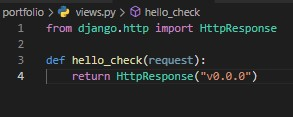
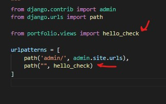

# DJANGO    
## Ambiente virutal y Settings
```powershell
# creamos entorno virtual
python -m virtualenv venv

# activamos el entorno virtual
.\venv\Scripts\activate

# instalamos django en el entorno
pip install django

# creamos el project
django-admin startproject [projecto] .
```

# Primeros pasos
```powershell
# realizamos las migraciones predeterminadas sqlite
python manage.py migrate

# Corremos el servidor
python manage.py runserver
```

# Views
Para crear Views en Django:
- debemos crear un archivo llamado views dentro de nuestro [projecto] y ahí empezar hacer las funciones de las vistas.
- Agregarlo en el archivo de urls.
- 
- 